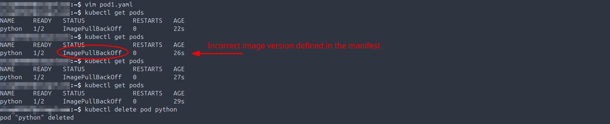
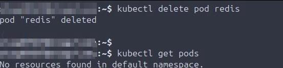

## Scope
This repo covers all projects, tasks, and troubleshooting in preperation for obtaining the KCNA. 

## Environment
- Minikube: v1.33.1
- kubectl: 1.33.4
- Operating System: Ubuntu 24.0.3 LTS
- YAML for manifests
- Visual Studio Code: v1.103.1

```
├── README.md
├── Minikube
│   ├── Installation
│   │   └── Install Minikube locally
│   ├── Create, validate, destroy
│   │   ├── Start cluster and check Minikube version
│   │   └── Stop the cluster
│   ├── Install, test and validate kubectl
│   │   └── Install kubectl, validate cluster info, check version
│   └── Troubleshooting
│       └── Fix startup issues and adjust memory allocation
├── Docker
│   ├── Installation
│   │   └── Install Docker locally, confirm Hello World container launches and SSH access
│   └── Version
│       └── Validate installed Docker version
├── Pods & Manifests
│   ├── Pods
│   │   └── Manual creation, deletion, and validation 
│   ├── Manifests
│   │   └── Create manifests and check YAML syntax
│   ├── Troubleshooting
│   │   └── Fix restart loops, incorrect images, or version issues
│   └── Manifest pod creation
│       ├── Create manifest and start pods
│       ├── Review pod details after confirming running
│       └── Delete pods and confirm removal
├── ReplicaSets
│   ├── Manifests
│   │   └── Create and modify ReplicaSets and Pods
│   └── Pods 
│       ├── Create and validate via ReplicaSet
│       ├── Delete and validate via ReplicaSet
│       └── Scale up/down via ReplicaSet
└── Deployments
    ├── Manifests
    │   └── Create deployment manifests and pods
    └── Testing, scale up, scale down, rollouts and rollbacks
        ├── Validate deployments
        ├── Create deployment manifests and pods
        ├── Validate replica scaling
        ├── Validate all deployment components
        ├── Deployment testing, rollouts, and rollbacks
        ├── Deployment version updates
        └── Further deployment scale up/down, testing, and version updates
```
## Minikube
- 08122025 Install Minikube.
  
- 08122025 Start cluster and Minikube version validation.
  
- 08122025 Validate the cluster is running, stop the cluster, then delete.
  
- 08142025 Install kubectl, start the cluster, validate cluster info, validate kubectl version.
  
- 08162025 Determined Minikube is not launching because it is not started, and when it is starting it is starting with too much memory allocated.
  
- 08162025 Fix Minikube not starting, reduce memory allocation create pod, create nginx pod.
  

## Docker
- 08132025 Install Docker and Launch Hello World container.
  
- 08132025 Validate locally installed Docker version.
  

## Pods & Manifests
- 08162025 Validate running pods on the node and then review pod details.
  
- 08162025 Delete the pod and validate no longer running on the node.
  
- 08162025 Create the manifest then validate both spacing and contents are correct.
  
- 08162025 Troubleshooting of pods not starting due to crash loop.
  
- 08162025 Troubleshooting of the wrong image being defined in the manifest.
  
- 08162025 Troubleshooting of the incorrect image version being defined in the manifest.
  
- 08162025 Describe running pods and review applicable details, speficially start process for all three.
  
- 08162025 Create a manifest for all three pods, start them, validate 3/3 are now running on the node.
  
- 08162025 Delete all three pods then validate they are gone on the node.
  

## Replicasets
- 08172025 ReplicaSet manifest created in Visual Studio Code, validate accesible through bash shell locally.
  
- 08172025 Create ReplicaSet manifest in bash, then validate the correct number of pods are started running in a healthy state.
  
- 08172025 Create new pod manifest in Visual Studio Code, validate available in bash, to be used with Replicaset testing.
  
- 08172025 Confirm correct number of pods defined in the Replicaset are running.
  
- 08172025 Delete a pod, then validate the Replicaset created and started new pod, validate 3/3 are running, so HA is functioning as intended.
  
- 08172025 Check the details of the Replicaset, specifically checking for both replica and pod counts.  
  
- 08172025 Edit the Replicaset manifest, scale the number of replicas to 4, confirm the fourth pod has been started, and is now running.  
  
- 08172025 Scale down the number of replicas to 2, without editing the manifest (using CLI syntax), then validate that only two pods are running.  
  
  
  ## Deployments
- 08172025 Create new deployment manifest, create the deployment, validate the pod status.
  
- 08172025 Validate the details of the newly created deployment.
  
- 08172025 Validate replicas are auto-scaling to the correct amount as intended per deployment specifications.
  
- 08172025 Validate all components of the new deployment are present, running, and in the intended state.
  
- 08172025 Delete the current deployment, scale up replicas to desired count, create a new deployment, validate both the replica count and deployment health.
  
- 08172025 Delete the current deployment, create and rollout a new deployment, validate 6/6 pods are up and healthy.
  
- 08172025 Create and annotate new deployment, roll it out, check the history and confirm the change-cause annotation is logged.
  
- 08172025 Validate the change-cause is annotated when describing the deployment.
  
- 08172025 Update the deployment manifest to a different image version, annotate the change-cause, rollout the deployment, then validate the deployment history.  
  
- 08172025 Validate the scaling of replicas in the deployment manifest.
  
- 08172025 Downgrade to version 3.21, validate this failed, rollback to version 3.22, validate change-cause annotations, validate the deployment, validate the number of pods and their health.
  
  
