## Scope
This repo covers all projects, tasks, and troubleshooting in preperation for obtaining the KCNA. 

## Environment
- Minikube: v1.33.1
- kubectl: 1.33.4
- Operating System: Ubuntu 24.0.3 LTS
- YAML for manifests
- Visual Studio Code: v1.103.1

```
├── README.md
└── Screenshots
|       ├── Deployments/
|       ├── Docker/
|       ├── Minikube/
|       ├── Namespaces/
|       ├── Networking/
|       ├── Pods/
|       ├── Replicasets/
|       ├── Security/
|       ├── Serviceaccounts/
├── Manifests (All manifests are stored here)
├── Deployments
│   ├── Manifests
│   │   └── Create deployment manifests and pods
│   └── Testing, scale up, scale down, rollouts and rollbacks
│       ├── Validate deployments
│       ├── Create deployment manifests and pods
│       ├── Validate replica scaling
│       ├── Validate all deployment components
│       ├── Deployment testing, rollouts, and rollbacks
│       ├── Deployment version updates
│       └── Further deployment scale up/down, testing, and version updates
├── Docker
│   ├── Installation
│   │   └── Install Docker locally, confirm Hello World container launches and SSH access
│   └── Version
│       └── Validate installed Docker version
├── Minikube
│   ├── Installation
│   │   └── Install Minikube locally
│   ├── Create, validate, destroy
│   │   ├── Start cluster and check Minikube version
│   │   └── Stop the cluster
│   ├── Install, test and validate kubectl
│   │   └── Install kubectl, validate cluster info, check version
│   └── Troubleshooting
│       └── Fix startup issues and adjust memory allocation
├── Namespaces
│   ├── Manifests
│   │   └── Create namespace manifests
│   └── Create namespace
│   └── Validate taints
├── Networking
│   ├── Troubleshooting
│   │   └── Network policy not being applied due to JSON error
├── Pods 
│   ├── Pods
│   │   └── Manual creation, deletion, and validation 
│   ├── Manifests
│   │   └── Create manifests and check YAML syntax
│   ├── Troubleshooting
│   │   └── Fix restart loops, erroneous images, version or version naming convention related issues
│   │   └── Fix pod not creating from image
│   └── Manifest pod creation
│       ├── Create manifest and start pods
│       ├── Review pod details after confirming running
│       └── Delete pods and confirm removal
├── ReplicaSets
│   ├── Manifests
│   │   └── Create and modify ReplicaSets and Pods
│   └── Pods 
│       ├── Create and validate via ReplicaSet
│       ├── Delete and validate via ReplicaSet
│       └── Scale up/down via ReplicaSet
├── Security
│   ├── Certificates
│   │   └── Create root certificate, create and sign admin certificate, create and sign system: masters cert
└── Serviceaccounts
│   ├── Manifest creation
│   └── Attach to pods
│   └── Token obtain and review - token attribute review
│   ├── Troubleshooting
│   │   └── Manifest not being applied to pod and service account
```
## Deployments
- 2025-08-17 Create new deployment manifest, create the deployment, validate the pod status.
  
- 2025-08-17 Validate the details of the newly created deployment.
  
- 2025-08-17 Validate replicas are auto-scaling to the correct amount as intended per deployment specifications.
  
- 2025-08-17 Validate all components of the new deployment are present, running, and in the intended state.
  
- 2025-08-17 Delete the current deployment, scale up replicas to desired count, create a new deployment, validate both the replica count and deployment health.
  
- 2025-08-17 Delete the current deployment, create and rollout a new deployment, validate 6/6 pods are up and healthy.
  
- 2025-08-17 Create and annotate new deployment, roll it out, check the history and confirm the change-cause annotation is logged.
  
- 2025-08-17 Validate the change-cause is annotated when describing the deployment.
  
- 2025-08-17 Update the deployment manifest to a different image version, annotate the change-cause, rollout the deployment, then validate the deployment history.  
  
- 2025-08-17 Validate the scaling of replicas in the deployment manifest.
  
- 2025-08-17 Downgrade to version 3.21, validate this failed, rollback to version 3.22, validate change-cause annotations, validate the deployment, validate the number of pods and their health.
  
- 2025-08-19 Update the deployment manifest with an image version that does not exist, confirm the rollout produces an error, confirm the number of pods up is 6 as expected and the other 3 are in a broken state due to trying to pull an image version that does not exist off DockerHub.
  
- 2025-08-19 Rollback deployment, confirm the pods terminated and the correct amount of replicas are now running.
  
- 2025-08-19 Validate the image version has been rolled back to the desired version.
  
- 2025-08-19 Validate the replica count is correct by describing the deployment.
  ```

## Docker
- 2025-08-13 Install Docker and Launch Hello World container.
  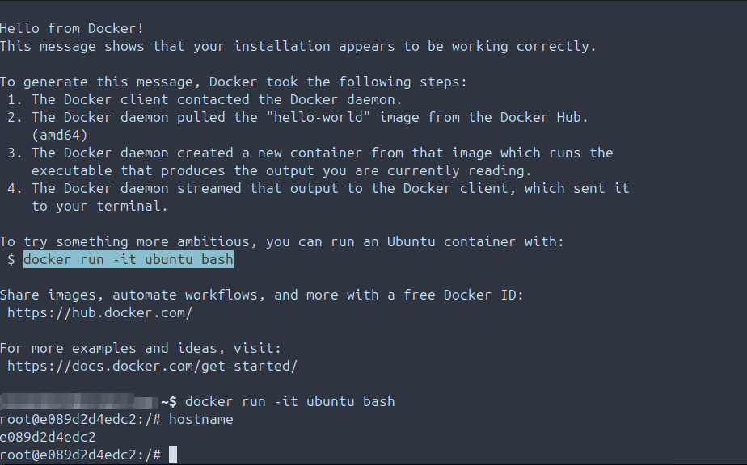
- 2025-08-13 Validate locally installed Docker version.
  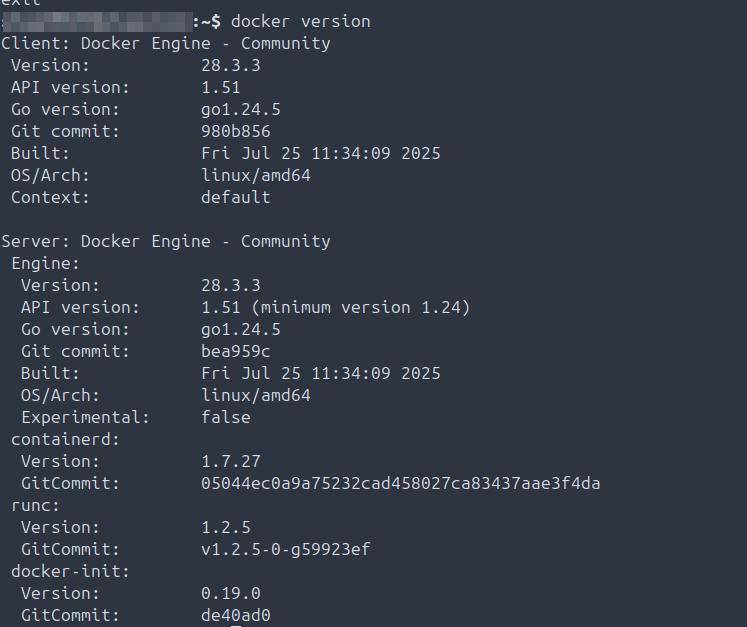

## Minikube
- 2025-08-12 Install Minikube.
  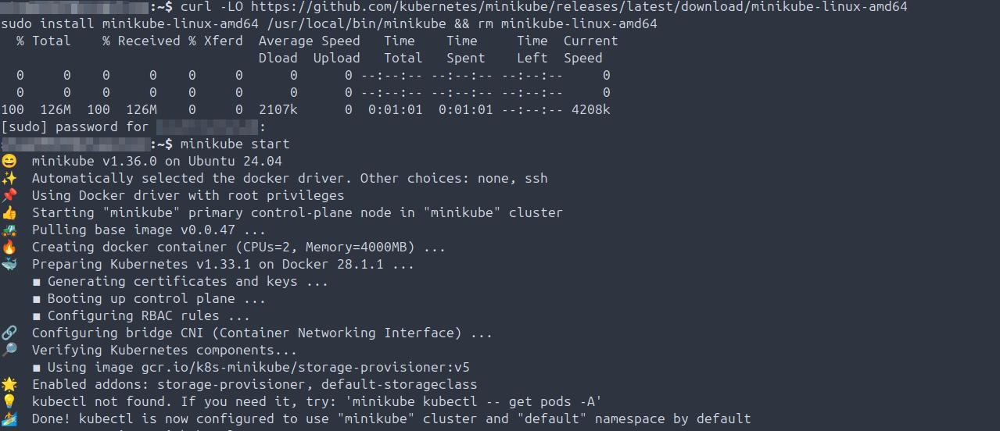
- 2025-08-12 Start cluster and Minikube version validation.
  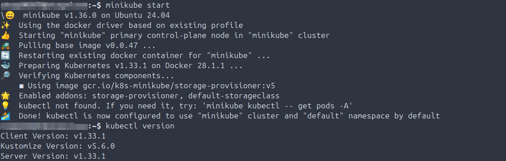
- 2025-08-12 Validate the cluster is running, stop the cluster, then delete.
  
- 2025-08-14 Install kubectl, start the cluster, validate cluster info, validate kubectl version.
  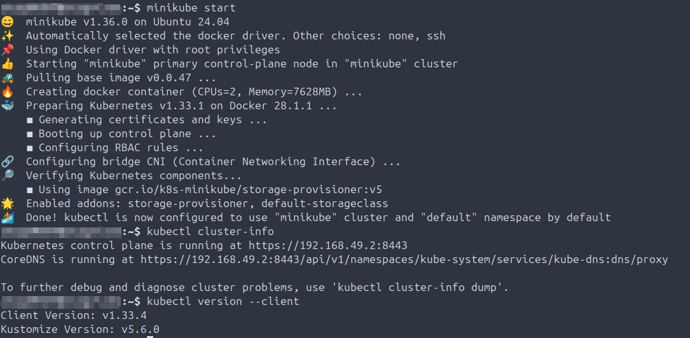
- 2025-08-16 Determined Minikube is not launching because it is not started, and when it is starting it is starting with too much memory allocated.
  
- 2025-08-16 Fix Minikube not starting, reduce memory allocation create pod, create nginx pod.
  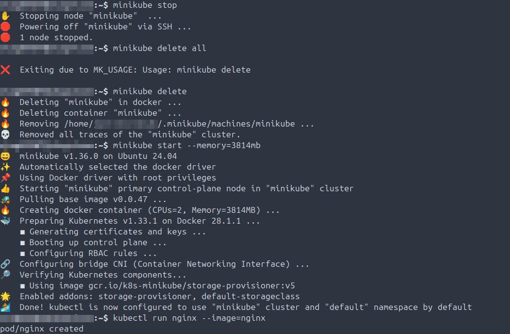

## Namespaces 
- 2025-08-19 Create namespace manifest then create first namespace.
  
- 2025-08-19 Create namespace with kubectl command.
  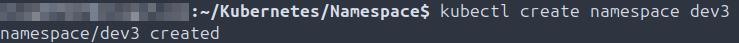
- 2025-08-19 Check if any taints are currently set on the node.
  

## Networking
- 2025-08-24 TROUBLESHOOTING: Create network policy manifest, apply to node, identify and correct JSON error in manifest, apply and validate applied to pod
    

## Pods
- 2025-08-16 Validate running pods on the node and then review pod details.
  
- 2025-08-16 Delete the pod and validate no longer running on the node.
  
- 2025-08-16 Create the manifest then validate both spacing and contents are correct.
  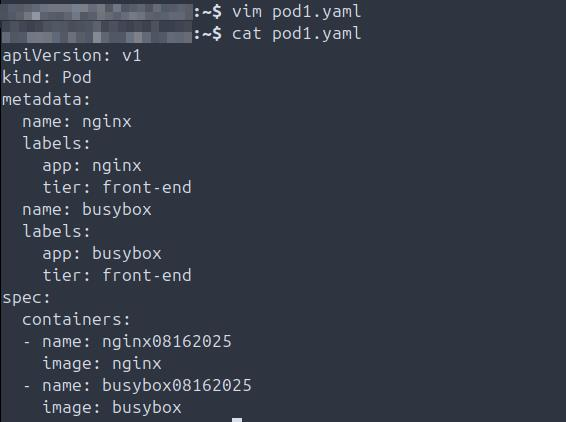
- 2025-08-16 TROUBLESHOOTING: Pod not starting due to acrash loop.
  
- 2025-08-16 TROUBLESHOOTING: tHE wrong image is defined in the pod manifest.
  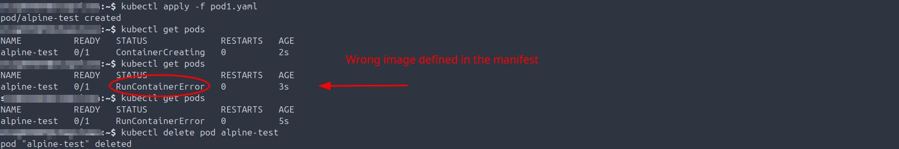
- 2025-08-16 TROUBLESHOOTING: The incorrect image version is defined in the pod manifest.
  
- 2025-08-16 Describe running pods and review applicable details, speficially start process for all three.
  
- 2025-08-16 Create a manifest for all three pods, start them, validate 3/3 are now running on the node.
  
- 2025-08-16 Delete all three pods then validate they are gone on the node.
  
- 2025-08-23 TROUBLESHOOTING: Pod won't create due to the image name not matching the correct vernacular that is on DockerHub.
  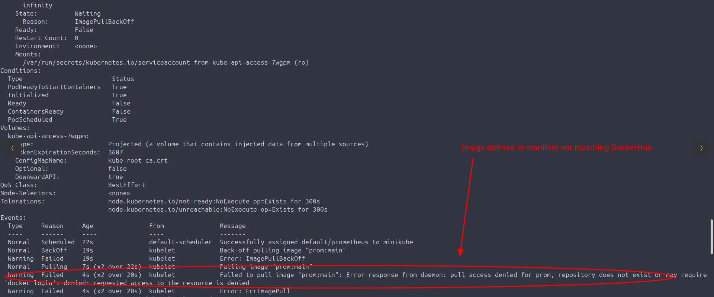
- 2025-08-23 TROUBLESHOOTING: The Prometheus pod will not start, found that the image in the manifest was incorrect. Deleted the pod.
  

## Replicasets
- 2025-08-17 ReplicaSet manifest created in Visual Studio Code, validate accesible through bash shell locally.
  
- 2025-08-17 Create ReplicaSet manifest in bash, then validate the correct number of pods are started running in a healthy state.
  
- 2025-08-17 Create new pod manifest in Visual Studio Code, validate available in bash, to be used with Replicaset testing.
  
- 2025-08-17 Confirm correct number of pods defined in the Replicaset are running.
  
- 2025-08-17 Delete a pod, then validate the Replicaset created and started new pod, validate 3/3 are running, so HA is functioning as intended.
  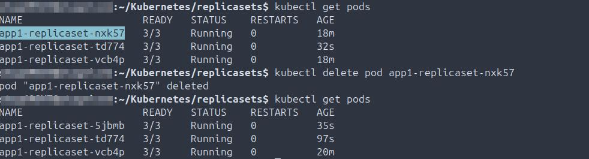
- 2025-08-17 Check the details of the Replicaset, specifically checking for both replica and pod counts.  
  
- 2025-08-17 Edit the Replicaset manifest, scale the number of replicas to 4, confirm the fourth pod has been started, and is now running.  
  
- 2025-08-17 Scale down the number of replicas to 2, without editing the manifest (using CLI syntax), then validate that only two pods are running.  
  
  
## Security
- 2025-08-21 Create the root certificate.
  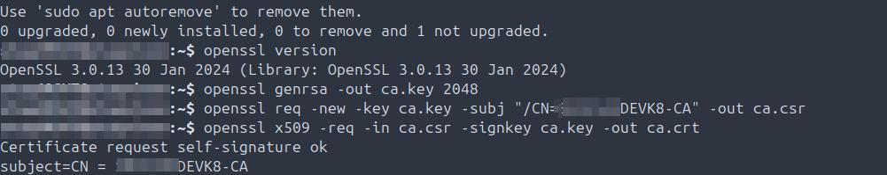
- 2025-08-21 Create and sign an administrator certificate.
  
- 2025-08-21 Create and sign the system masters certificate.
  
- 2025-08-21 Create and sign certificates for the kube-scheduler, kube-controller-manager and kube-proxy services.
  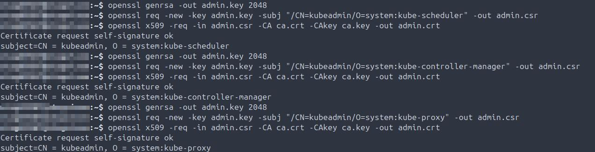

## Service Accounts
- 2025-08-21 Create a service account, validate on the node, describe the service account.
  
- 2025-08-21 Describe a pod with an attached service account.
  
- 2025-08-23 Grab Java Web Token (JWT) for the Prometheus pod.
  
- 2025-08-23 Install jq so am able to view the decoded token JSON, view both the exp and iat values in the token, calculate to confirm the token expiration is set for one year. Both are set in seconds and the formula for determining the token TTL is exp - iat = token expiration date.
  
- 2025-08-23 TROUBLESHOOTING: The manifest is not creating either the serviceaccount or the pod, Visual Studio Code (VSC) is not updating the manifest on the node. Updated the manifest on the node then deleted the pod, re-applied the manifest, validated each have now been created.
  
