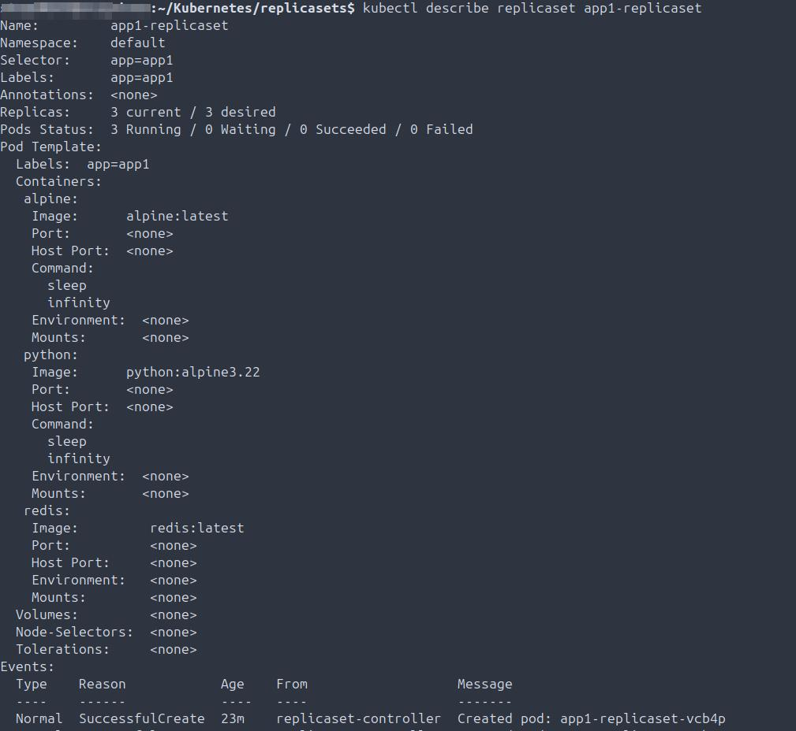
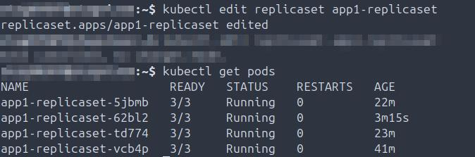
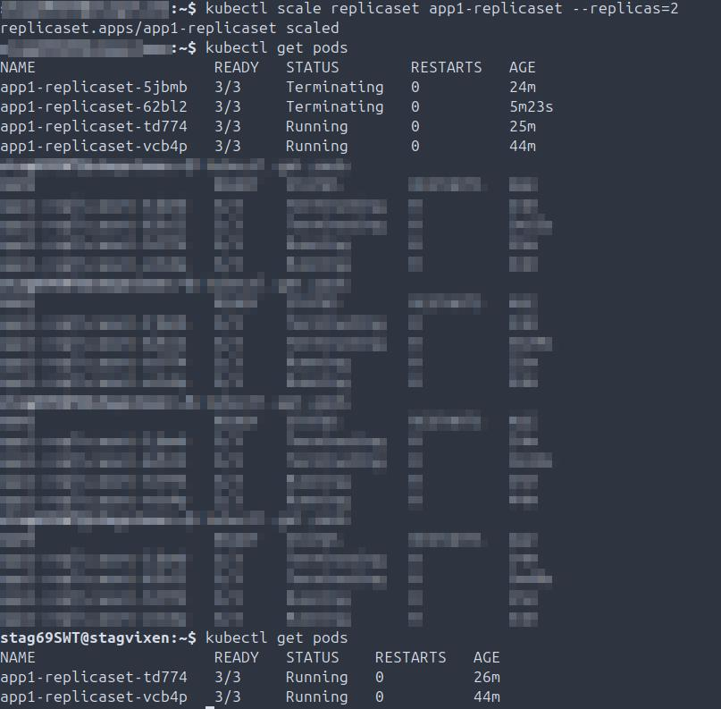

## Scope
This repository captures comprehensive, enterprise-grade Kubernetes and GCP operations, including provisioning, automation, and troubleshooting. It documents hands-on implementations across container orchestration, infrastructure as code, observability, security, and multi-environment cloud deployments, demonstrating both practical expertise and real-world operational workflows.

All projects, manifests, and exercises reflect production-style scenarios, showcasing the ability to deploy, manage, and troubleshoot complex Kubernetes clusters and cloud resources efficiently.

## Environment
This lab was executed on a modern enterprise Kubernetes and GCP stack, including the following core tools and platforms:

Operating System: Ubuntu 24.04 LTS

Containerization: Docker 28.3.3

Kubernetes: kubectl 1.33.4, Minikube v1.33.1

Service Mesh: Istio 1.27.0 (demo profile)

Infrastructure as Code: Terraform v1.13.1

Cloud Platform: Google Cloud Platform (Compute Engine, Cloud Storage, IAM, Billing, gcloud CLI)

Development Tools: Visual Studio Code v1.103.1, YAML manifests

This environment supports end-to-end experimentation, including cluster provisioning, service deployment, monitoring, storage management, networking, and security validation across multiple namespaces and cloud resources.
```
├── README.md
├── Screenshots/                # Visual documentation of all tasks
│   ├── Deployments/
│   ├── Docker/
│   ├── GCP/
│   ├── Istio/
│   ├── Minikube/
│   ├── Namespaces/
│   ├── Networking/
│   ├── Pods/
│   ├── ReplicaSets/
│   ├── Security/
│   ├── ServiceAccounts/
│   ├── Storage/
│   └── Terraform/
├── Manifests/                  # YAML manifests for Kubernetes resources
├── Deployments/                # Deployment manifests & testing (rollouts, scaling, rollback)
├── Docker/                     # Docker installation, container management, volumes
├── GCP/                        # GCP provisioning, storage, VM management, billing, IAM
├── Istio/                      # Service mesh setup, Bookclub demo app, gateway & virtual services
├── Minikube/                    # Local Kubernetes cluster setup, load balancer, filesystem management
├── Namespaces/                  # Namespace creation, management, and taint validation
├── Networking/                  # Network policies and troubleshooting
├── Pods/                        # Pod creation, validation, troubleshooting, volume testing
├── ReplicaSets/                 # ReplicaSet manifests, pod scaling, HA validation
├── Security/                    # Certificates, JSON keys, Kubernetes secrets
├── ServiceAccounts/             # Service account creation, JWT retrieval, pod attachment
├── Storage/                     # PersistentVolume (PV) and PersistentVolumeClaim (PVC) creation & validation
└── Terraform/                   # Terraform manifests, provisioning, validation, and destruction
```
## Deployments
**Summary:** This section covers creating, updating, rolling out, scaling, and troubleshooting Kubernetes deployments. Demonstrates knowledge of pod lifecycle, replication, rollout strategies, annotations, and error handling.

- 2025-08-17 Create deployment manifest, deploy, and validate pod status.
  
- 2025-08-17 Validate deployment details.
  
- 2025-08-17 Validate auto-scaling of replicas per deployment specifications.
  
- 2025-08-17 Confirm all components are running and in intended state.
  
- 2025-08-17 Delete deployment, scale replicas, create new deployment, validate replicas and health.
  
- 2025-08-17 Rollout new deployment, validate 6/6 pods are up and healthy.
  
- 2025-08-17 Annotate deployment, roll it out, check history, confirm change-cause annotation.
  
- 2025-08-17 Validate change-cause in deployment description.
  
- 2025-08-17 Update deployment image, annotate change-cause, rollout, validate history.  
  
- 2025-08-17 Validate scaling of replicas.
  
- 2025-08-17 Downgrade deployment (fail), rollback, validate change-cause annotations and pod health.
  
- 2025-08-19 Deploy invalid image, confirm rollout error, validate broken pods and correct replica count.
  
- 2025-08-19 Rollback deployment, confirm pods terminated and correct replicas running.
  
- 2025-08-19 Validate image version rolled back.
  
- 2025-08-19 Confirm replica count via deployment description.
  

## Docker
**Summary:** This section demonstrates installing Docker, launching containers, creating and mounting volumes, and validating persistent storage at the container level.

- 2025-08-13 Install Docker and launch Hello World container.
  
- 2025-08-13 Validate locally installed Docker version.
  
- 2025-09-01 Create local volume on node, validate availability.
  
- 2025-09-01 Start container with attached local volume, validate pod writing to volume, connect via exec -it, confirm data written.
  

## GCP
**Summary:** This section covers provisioning compute resources and storage buckets, configuring IAM and gservice accounts, managing billing, creating snapshots, and enabling authentication from local workstation. Emphasizes cloud operations and observability.

- 2025-08-29 Create storage buckets in GCP project for compute VMs, Prometheus monitoring/observability, and Kubernetes.
  
- 2025-08-29 Create primary VM in GCP project to provision worker VMs with Terraform.
  
- 2025-08-29 Create RSA keypair on main workstation to facilitate SSH authentication to primary GCP VM.
  
- 2025-08-29 Add public key to primary GCP VM, validate SSH authentication from main workstation.
  
- 2025-08-29 Create bash script on primary workstation to facilitate faster SSH authentication to primary GCP VM.
  
- 2025-08-29 Change primary Terraform GCP VM IP type to standard ephemeral and network type to standard in GCP Compute.
  
- 2025-08-29 Install and validate the gcloud shell on main workstation.
  
- 2025-09-02 Review and analyze overall spend for the month in Billing.
  
- 2025-09-02 Additional review and analysis of spend by project and service.
  
- 2025-09-02 Review Billing dashboard.
  
- 2025-09-02 Filter Billing dashboard by SKU.
  
- 2025-09-02 Generate billing report.
  
- 2025-09-02 Set alerting thresholds for budgeting in Billing.
   
- 2025-08-29 Assign primary VM persistent disk to snapshot schedule.
  
- 2025-09-01 Validate primary disk for Terraform bastion host assigned to snapshot schedule, confirm run times.
  
- 2025-09-01 Create one-off snapshot for primary disk/bastion host, validate success.
  
- 2025-09-02 Enable authentication to GCP project using gcloud from primary workstation.
  
- 2025-09-02 Create service account, assign Storage Admin IAM binding via gcloud.
  
- 2025-09-02 Validate current buckets in Cloud Storage accessible via gcloud from Minikube.
  
- 2025-09-02 Create multiple service accounts, assign Storage Admin IAM bindings via gcloud.
  

## Istio
**Summary:** Installation and validation of Istio service mesh, deploying sample applications, creating gateways, exposing services externally, and validating ingress traffic.

- 2025-08-24 Install Istio with demo profile, validate installation stability.
  
- 2025-08-13 Validate locally installed Istio version.
  
- 2025-08-29 Install Bookclub app in Istio default namespace with demo profile, validate services and pods are running.
  
- 2025-08-29 Validate Bookclub app in default namespace is accepting HTTP requests served by Praqma pod using curl.
  
- 2025-08-29 Create gateway and virtual networking services in Istio default namespace, confirm gateway is up, export INGRESS_NAME, validate external IP created, export INGRESS_PORT, SECURE_INGRESS_PORT, and TCP_INGRESS_PORT.
  
- 2025-08-29 Validate Bookclub app is accessible via curl in default Istio namespace.
  
- 2025-08-29 Validate both load balancer external IP & internal cluster IPs, confirm $GATEWAY_URL matches external IP.
  
- 2025-08-29 Validate Bookclub app IP exposed externally, reachable via browser.
  
- 2025-08-29 Validate Bookclub app is externally exposed and serving round-robin reviews from app in default Istio namespace.
  
- 2025-08-29 Cleanup and shutdown Bookclub application in default Istio namespace.
  

## Minikube
**Summary:** Local Kubernetes cluster setup, pod deployment, external load balancer provisioning, filesystem creation, and troubleshooting Minikube startup issues.

- 2025-08-12 Install Minikube.
  
- 2025-08-12 Start cluster and validate Minikube version.
  
- 2025-08-12 Validate cluster is running, stop cluster, then delete.
  
- 2025-08-14 Install kubectl, start cluster, validate cluster info and kubectl version.
  
- 2025-08-16 Identify Minikube not launching due to memory allocation; reduce memory and start cluster, create nginx pod.
  
- 2025-08-16 Fix Minikube not starting, reduce memory allocation create pod, create nginx pod.
  
- 2025-08-29 Start and validate external load balancer in Minikube.
  
- 2025-09-02 Create and validate filesystem on Minikube VM.
  

## Namespaces
**Summary:** Demonstrates creating and managing Kubernetes namespaces, validating taints, and applying proper namespace scoping for resources.

- 2025-08-19: Create namespace using manifest, then create the first namespace.
  
- 2025-08-19: Create namespace directly with kubectl command.
  
- 2025-08-19: Inspect node for any existing taints.
  
- 2025-09-02: Create multiple namespaces and validate proper creation and functionality.
  

## Networking
**Summary:** Covers applying network policies, identifying manifest errors, and validating connectivity to pods, showing hands-on troubleshooting skills for Kubernetes networking.

- 2025-08-24: TROUBLESHOOTING: Create a network policy manifest, apply it to the node, identify and correct JSON errors in the manifest, apply changes, and validate the policy is correctly applied to the pod.
    

## Pods
**Summary:** Creation, management, troubleshooting, and validation of pods. Includes manifest writing, exec into containers, volume mounts, and pod lifecycle events.

- 2025-08-16: Validate running pods on the node and review pod details.

- 2025-08-16: Delete a pod and confirm it is no longer running on the node.

- 2025-08-16: Create pod manifests, validate formatting, spacing, and content correctness.

2025-08-16: TROUBLESHOOTING: Resolve a pod not starting due to a crash loop.

2025-08-16: TROUBLESHOOTING: Fix pod with the wrong image defined in the manifest.

2025-08-16: TROUBLESHOOTING: Correct pod with incorrect image version.

2025-08-16: Describe running pods and review start processes for all pods.

2025-08-16: Create multiple pods via manifest, start them, validate 3/3 are running.

2025-08-16: Delete all pods and confirm none remain on the node.

2025-08-23: TROUBLESHOOTING: Correct pod creation failure due to DockerHub image name mismatch.

2025-08-23: TROUBLESHOOTING: Resolve Prometheus pod failing to start due to incorrect image.

2025-08-23: Validate all available Kubernetes API resources on the node.

2025-08-29: Write and deploy Praqma pod manifest, validate pod is running.

2025-09-01: Create Golang pod from manifest, validate running state, connect via exec -it, and confirm hostPath volume is writing data.

2025-09-01: Describe Golang pod to confirm hostPath volume mount and configuration.

2025-09-02: Validate pod label selectors properly filter and sort pods by assigned labels.


## ReplicaSets
**Summary:** Covers ReplicaSet manifest creation, scaling, validating replica counts, and ensuring high availability by recreating deleted pods automatically.

- 2025-08-17: Create ReplicaSet manifest in Visual Studio Code, validate accessibility via bash.
  
- 2025-08-17: Create ReplicaSet manifest via bash, validate correct number of pods are running and healthy.
  
- 2025-08-17: Create new pod manifest in Visual Studio Code for ReplicaSet testing, validate availability in bash.
  
- 2025-08-17: Confirm correct number of pods defined in the ReplicaSet are running.
  
- 2025-08-17: Delete a pod and validate that ReplicaSet automatically creates a new pod; ensure 3/3 pods are running (HA validation).
  
- 2025-08-17: Check details of the ReplicaSet, including replica and pod counts.
  
- 2025-08-17: Edit ReplicaSet manifest to scale replicas to 4, confirm the fourth pod is created and running.
  
- 2025-08-17: Scale down replicas to 2 using CLI without editing the manifest, validate only two pods are running.
  
  
## Security
**Summary:** Creating certificates for Kubernetes components, signing them, managing gservice account keys, and creating Kubernetes secrets to secure sensitive credentials.

- 2025-08-21: Create the root certificate.
  
- 2025-08-21: Create and sign an administrator certificate.
  
- 2025-08-21: Create and sign the system masters certificate.
  
- 2025-08-21: Create and sign certificates for kube-scheduler, kube-controller-manager, and kube-proxy services.
  
- 2025-09-02: Create JSON keys and assign them to each applicable GCP service account.
  
- 2025-09-02: Create Kubernetes secrets from JSON keys for use by all three GCP service accounts.
  

## ServiceAccounts
**Summary:** Demonstrates creation of service accounts, attaching them to pods, decoding JWT tokens, validating token TTL, and troubleshooting service account deployment issues.

- 2025-08-21: Create a service account, validate on the node, describe the service account.
  
- 2025-08-21: Describe a pod with an attached service account.
  
- 2025-08-23: Grab Java Web Token (JWT) for the Prometheus pod.
  
- 2025-08-23: Install jq locally to view the decoded token JSON; check exp and iat values to confirm token expiration is set for one year.
  
- 2025-08-23 (TROUBLESHOOTING): Manifest not creating service account or pod; updated the manifest on the node, deleted the pod, re-applied the manifest, validated creation.
  

## Storage
**Summary:** Demonstrates PersistentVolume (PV) and PersistentVolumeClaim (PVC) creation, ephemeral storage validation, mounting across pods, multi-namespace validation, and StorageClass creation.

- 2025-09-01: Write PersistentVolume manifest for both Redis and Nginx pods, validate creation and review details via kubectl describe.
  
- 2025-09-01: Write manifest for both Nginx and Redis pods, start and validate running 2/2; illustrate difference between persistent and ephemeral storage.
  
- 2025-09-01: Describe Redis pod and validate automatically created ephemeral volume is present and mapped to the pod; check mountpoint.
  
- 2025-09-01: Describe Nginx pod and validate automatically created ephemeral volume is present and mapped to the pod; check mountpoint.
  
- 2025-09-01: Write PersistentVolumeClaim (PVC) manifest, apply, validate bound to PersistentVolume (PV).
  
- 2025-09-02: Create multiple pods and associated PersistentVolumes in multiple namespaces, validate creation, ready status, and namespace.
  
- 2025-09-02: Validate multiple PV and PVC bind status across multiple namespaces.
  
- 2025-09-02: Create and validate StorageClass on node.
  

## Terraform
**Summary:** Shows declarative infrastructure management in GCP including installing Terraform, initializing, planning, applying manifests, and destroying resources declaratively.

- 2025-08-29: Install Terraform and validate on primary GCP VM.
  
- 2025-09-02: Initialize Terraform, validate no issues.
  
- 2025-09-02: Run terraform plan against manifest, validate no issues.
  
- 2025-09-02: Validate GCP compute environment prior to applying compute manifest.
  
- 2025-09-02: Apply compute manifest using Terraform, validate additional compute resources have been provisioned declaratively.
  
- 2025-09-02: Validate additional compute resources (VMs) are present in the GCP project compute service.
  
- 2025-09-02: Apply compute manifest using Terraform, validate additional compute resources have been destroyed declaratively.
  
